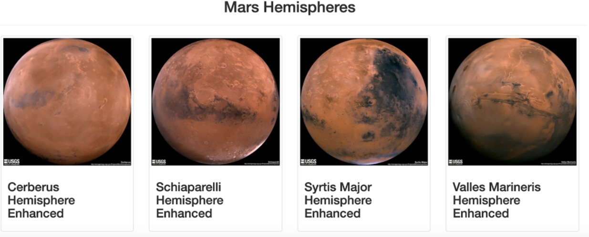
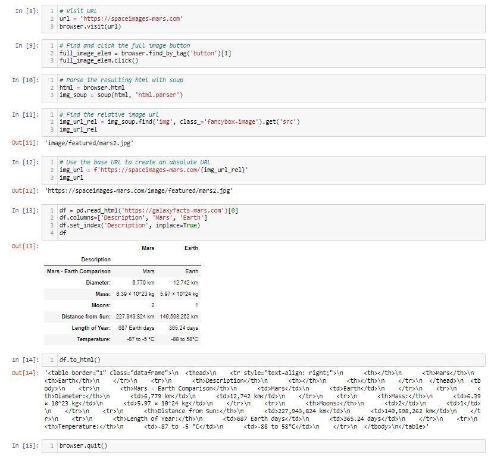
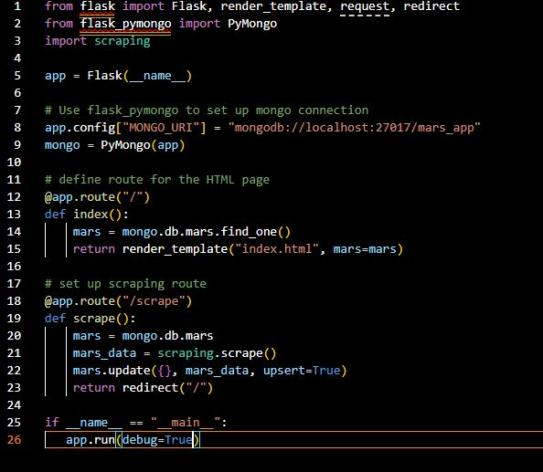
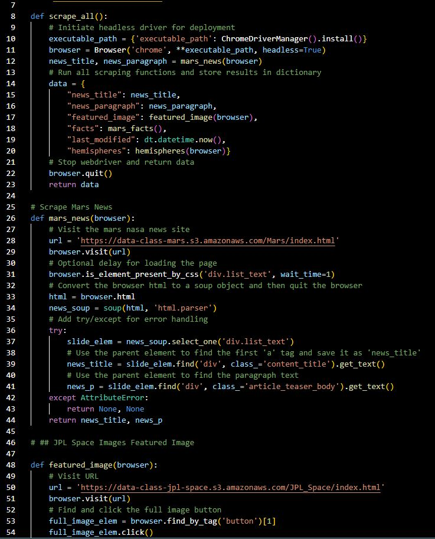
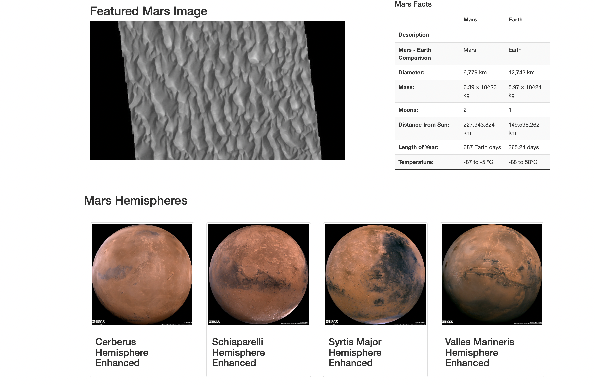

# Mission To Mars 
## Devin Monsen
### 09/24/2022

## Overview of the Mission To Mars Project ##

This project resulted in a web scraping Python app that connects to an HTML webpage through a button. Using tag searching in a python scraping function, I was able to find the content wanted and parse that into a Mongo database through a Flask server. Then finally pass that data into our webpage for display.

## Tools For Development

### Libraries
-  Beautiful Soup 4.11.0
-  Bootstrap 5.3.0-alpha1 CDN
-  Flask 2.2.2
-  PyMongo 2.3.0
-  Pandas 1.5.3
-  webDriverManager 3.8.5
-  Splinter 0.19.0
-  MongoDB 6.0.1

### Code
- Jupyter Notebook
- Python
- HTML
- GitBash
- Mongosh

## Development Process
### Step 1: Scraping App
To start the process I visited [NASA Mars News](https://mars.nasa.gov/news/?page=0&per_page=40&order=publish_date+desc%2Ccreated_at+desc&search=&category=19%2C165%2C184%2C204&blank_scope=Latest) webpage. Using the dev tools I was able to identify where on the page the content I wanted was. Using their html tags I now was able to go into the Jupyter Notebook. Using Beautiful Soup's html.parser I told it to find the text of the first 
 tag. Then repeated that process to get the title and article paragraph based off their HTML class identifiers. 

  After that it was time to scrape the images. Using the [Mars Space Images](https://spaceimages-mars.com) webpage I then used Splinter's .find_by_tag to make the browser automate clicking the immage buttons. Then back to parsing the webpage, finding the image by HTML tag and class, assigning them to a variable and passing them into the database.

Next thing to do was pull the webpages dataframe using Pandas. The [NASA Mars Facts](https://galaxyfacts-mars.com) webpage provides a table element for us. By using Pandas .read_html with the webpage parameter, I was was abe to pull the table. Set my columns and index then turn the Pandas df into HTML code to pass into the webpage I'm creating. 

## Step 2: Python Apps

Moving forward I exported the Jupyter Notebook into a Python file and cleaned it. The notebook functions were then defined into callable functions for our app and HTML to be able to interact with. Last bit was to write up a Python app file. Here I started by connecting to the Flask server and declaring that ass my app variable. Then using PyMongo to connect to the Mongo database for local data storage. First function connects our server and database to the HTML index route. Then the second function is a route to the scraper app. Lastly inserting an if statement to ensure proper function and if true running the app!
  

